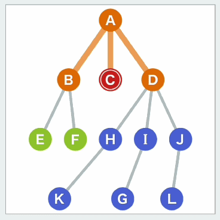
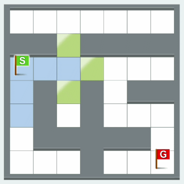

# BFS(Breath-First Search)

> 그래프에서 가까운 노드부터 우선적으로 탐색하는 **너비 우선 탐색 알고리즘**

> |               |  **DFS**  |   **BFS**   |
> | :-----------: | :-------: | :---------: |
> | **동작 원리** |   스택    |     큐      |
> | **구현 방법** | 재귀 함수 | 큐 자료구조 |
>
> 

> 1. 탐색 시작 노드를 큐에 삽입하고 방문 처리를 한다.
> 2. 큐에서 노드를 꺼내, 해당 노드의 인접 노드 중에서 방문하지 않은 노드를 모두 큐에 삽입하고, 방문처리를 한다.
> 3. `2`번의 과정을 더 이상 수행할 수 없을 때까지 반복한다.

<br>



<br>

## BFS 구현

```python
from collections import deque

def bfs(graph, start, visited):
    queue = deque([start])
    # 현재 노드를 방문 처리
    visited[start] = True
    # 큐가 빌 때까지
    while queue:
        # 큐에서 하나의 원소를 뽑아 출력
        v = queue.popleft()
        print(v, end= ' ')
        # 해당 원소와 연결된 원소들 중,
        for i in graph[v]:
            # 아직 방문하지 않은 원소들을 큐에 삽입
            if not visited[i]:
                queue.append(i)
                visited[i] = True

graph = [
    [],
    [2, 3, 8],
    [1, 7],
    [1, 4, 5],
    [3, 5],
    [3, 4],
    [7],
    [2, 6, 8],
    [1, 7]
]

visited = [False] * 9

bfs(graph, 1, visited)
# 1 2 3 8 7 4 5 6 
```

<br>

## BFS를 이용한 미로 탐색 시뮬레이션

| **(1, 1)** | **(1, 2)** | **(1, 3)** | **(1, 4)** | **(1, 5)** | **(1, 6)** | **(1, 7)** |
| :--------: | :--------: | :--------: | :--------: | :--------: | :--------: | :--------: |
| **(2, 1)** | **(2, 2)** | **(2, 3)** | **(2, 4)** | **(2, 5)** | **(2, 6)** | **(2, 7)** |
| **(3,1 )** | **(3, 2)** | **(3, 3)** | **(3, 4)** | **(3, 5)** | **(3, 6)** | **(3, 7)** |
| **(4, 1)** | **(4, 2)** | **(4, 3)** | **(4, 4)** | **(4, 5)** | **(4, 6)** | **(4, 7)** |
| **(5, 1)** | **(5, 2)** | **(5, 3)** | **(5, 4)** | **(5, 5)** | **(5, 6)** | **(5, 7)** |
| **(6, 1)** | **(6, 2)** | **(6, 3)** | **(6, 4)** | **(6, 5)** | **(6, 6)** | **(6, 7)** |
| **(7, 1)** | **(7, 2)** | **(7, 3)** | **(7, 4)** | **(7, 5)** | **(7, 6)** | **(7, 7)** |

<br>

