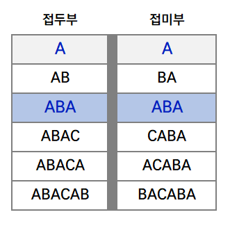

<h1>KMP Algorithm</h1>

KMP 알고리즘은 Knuth, Morris, Prett 라는 분들이 만드셔서 앞글자를 따서 이름이 정해졌습니다.

한 줄 요약 : 불일치가 발생하기 직전까지 같았던 부분은 다시 비교하지 않고 검색을 해보자!

**시간복잡도** : **O(N+M)** => N : 텍스트의 길이, M : 패턴의 길이(brute force는 O(NM) 입니다.)

---

예시 문자열 == 'ABCDEFG'

- 접두부 : 문자열의 왼쪽에서부터 시작하고, 차례대로 한 개씩 더 읽어가면서 만든다

  A, AB, ABC, ABCD, ABCDE, ABCDEF

- 접미부 : 문자열의 오른쪽에서부터 시작하고, 차례대로 한 개씩 더 읽어가면서 만든다

  G, FG, EFG, DEFG, CDEFG, BCDEFG

- 경계 : 접두부와 접미부가 같은 경우의 접두부와 접미부를 각각 경계라고 부릅니다

---

진행 순서(본문 == 'ABACABAACABACABAC', 패턴 == 'ABACABAC')

1. 패턴을 본문에 처음에 둡니다.

   

2. 비교하는 부분에서 일부가 일치하지 않는다면, 일치하는 부분에서 최대 길이의 경계를 찾습니다.

   1. 일치하는 부분이 존재하고, 경계가 있는경우

      

      

   2. 경계를 찾지 못하거나, 모두 불일치할 경우 

      => 처음으로 불일치했던 부분까지 패턴을 이동시킵니다. (이 경우는 3번으로 안가고 1번으로 바로 이동)

3. 경계는 접두부와 접미부가 같은 부분이므로, 패턴의 접두부와 본문(비교대상인 부분에서)의 접미부까지 이동시킵니다

   

---

위와 같은 과정으로 진행할 때, 이동거리를 알아야합니다.

- 이동경로 테이블 : 얼마나 이동시켜야 하는지 알 수 있게 하는 테이블
- 일치하는 패턴의 길이 : 본문과 찾으려는 패턴을 맨 앞에서부터 비교하여 어느 지점에서 불일치가 발생하였다면, 그 직전까지 일치하는 패턴의 길이
- 최대 경계 너비 : 본문과 패턴 간에 일치하는 부분에서 경계를 찾고, 그들 중 최대의 길이값
- 이동 거리 : 일치하는 패턴의 길이 - 최대 경계 너비


1. 일치하는 패턴의 길이가 0
   - 본문과 패턴이 처음부터 다르다면, 패턴은 한 칸만 이동시켜야 하므로, 이동거리 공식에 의해서 최대 경계 너비 값을 -1로 설정
2. 일치하는 패턴의 길이가 1
   - A 에서 경계를 찾을 수 없으므로 최대 경계 너비값은 0
3. 일치하는 패턴의 길이가 2
   - AB 에서 경계를 찾을 수 없으므로 최대 경계 너비값은 0
4. 일치하는 패턴의 길이가 3
   - ABA에서 경계는 **A** 하나만 나오고 이 때의 접두부 길이가 최대 경계 너비값이 됩니다. 1
5. 일치하는 패턴의 길이가 4
   - ABAC에서 경계를 찾을 수 없으므로 최대 경계 너비값은 0
6. 일치하는 패턴의 길이가 5
   - ABACA에서 경계는 **A** 하나만 나오므로 이 때 최대 경계 너비값 = 1
7. 일치하는 패턴의 길이가 6
   - ABACAB에서 경계는 **AB** 하나만 나오고 이 때 최대 경계 너비값 = 2
8. 일치하는 패턴의 길이가 7
   - ABACABA에서 경계를 찾으면 **A, ABA**이므로 최대 길이의 경계는 **ABA**여서 최대 경계 너비값 = 3
9. 일치하는 패턴의 길이가 8
   - ABACABAA에서 경계를 찾으면 **A** 하나만 나오고 이 때 최대 경계 너비값 = 1
10. 일치하는 패턴의 길이가 9
    - 찾으려는 패턴 9글자가 모두 일치하므로 찾기 성공
    - 하지만 본문 전체를 확인해야하기 때문에, 최대 경계 너비 확인 0


---

예시


- 일치하는 패턴의 길이(=7)에 해당하는 최대 경계 너비값(=3) 읽고, 이동거리(=4)를 계산하고 이동합니다


- 4칸 이동한 후에는 일치하는 패턴의 길이가 ABACABA 까지 7이므로, 이동거리 확인하고 이동


- 전체를 탐색했으니 종료합니다.

---

구현

```python
def KMPsearch(string, pattern):
    #이동경로 테이블 만들기
    table=[0 for i in range(len(pattern+1))]
	table[0]=-1
    j=0
    for i in range(1,len(pattern)):
        while pattern[j]!=pattern[i] and j>0:
            j=table[j]
        
        if pattern[j]==pattern[i]:
            j+=1
            table[i+1]=j
    #이동경로 테이블
    
    #본문에서 검색 시작
    findFlag=False
    distance, cnt=0, 0
    while True:
        idx=0
        
        if idx+distance+len(pattern)>len(string):
            break
        
        while string[idx+distance]==pattern[cnt]:
            cnt+=1
            idx+=1
            
            if cnt==len(pattern):
                print('성공!')
                findFlag=True
                break
		
        distance+=(cnt-table[cnt])
        cnt=0
        
    if not findFlag:
        print('찾기 실패!')

KMPsearch("ABAABACABAACCABACABACABAACABACABAAC","ABACABAAC")
```