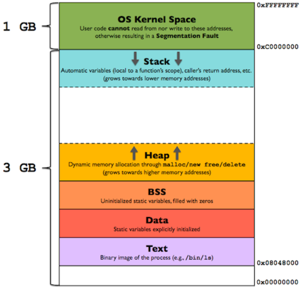
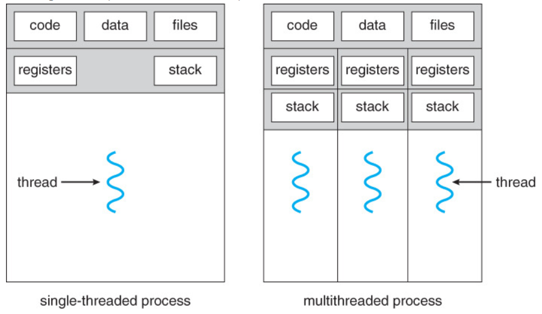

# 프로세스와 스레드 (Process vs Thread)

### 프로세스(Process)

**프로그램과 프로세스**

- 프로그램: 어떤 작업을 위해 실행할 수 있는 파일
- 프로세스: 프로그램이 메모리에 올라와 CPU를 할당받고 프로그램이 실행되고 있는 상태
- 프로그램은 정적인 개념, 프로세스는 동적인 개념으로서 프로그램이 실행중인 상태

**프로세스**

- 컴퓨터에서 연속적으로 실행되고 있는 컴퓨터 프로그램
- 메모리에 올라와 실행되고 있는 독립적인 인스턴스(개체)
- 운영체제로부터 시스템 자원을 할당받는 작업 단위, 종종 스케줄링의 대상이 되는 작업(task)이라는 용어와 거의 같은 의미로 쓰인다.
- 기본적으로 프로세스당 최소 1개의 스레드(메인 스레드)를 가짐
- 프로세스는 독립된 메모리 영역(code, data, stack, heap)을 할당 받음
- 프로세스는 별도의 주소 공간에서 실행되므로, 다른 프로세스의 주소 공간(변수 ,자료구조 등)에 접근할 수 없음
- 프로세스간의 데이터 통신을 위해 IPC(Inter-Process-Communication)을 통해 데이터를 주고 받을 수 있음

### 스레드(Thread)

- 프로세스 내에서 실행되는 흐름의 단위
- 일반적으로 한 프로세스는 하나의 스레드를 가지고, 둘 이상의 스레드를 동시에 실행한다면 이를 멀티스레드(Multi-Thread)라 함
- 스레드는 프로세스 내에서 stack만 따로 할당 받고, code, data, heap 영역은 공유
- 프로세스 내의 주소 공간이나 자원들(Heap 공간)을 같은 프로세스 내에 스레드끼리 공유
- 개별 스레드는 별도의 Register와 Stack을 갖고, Heap 메모리는 서로 읽고 쓸 수 있음

### 프로세스의 메모리 (memory map)

프로세스는 운영체제로부터 CPU시간, 주소공간, 독립된 메모리 영역(Code, Data, Stack, Heap)을 할당 받음

​																														 [사진출처](https://gabrieletolomei.wordpress.com/miscellanea/operating-systems/in-memory-layout/)

**Code**

- text영역이라고도 불림
- 실행할 프로그램의 코드가 저장되는 영역
- CPU는 이 영역에 저장된 명령어를 하나씩 가져와 수행
- 프로그램이 시작되고 끝날때까지 메모리 영역에 유지

**Data**

- 전역(global)변수와 정적(static)변수가 저장되는 영역
- 프로그램이 시작될 때 할당되고 종료될 때 해제
- BSS와 GVAR영역을 통틀어 data영역이라고 함
  - BSS : 초기값 없는 전역변수, static 변수
  - GVAR : 초기값 있는 전역변수, static 변수

**Stack**

- 프로그램에 의해 사용되는 임시 데이터 영역
- 함수 호출시 생성되는 지역변수, 매개변수를 저장. 함수 종료시 해제.
- 메모리 주소는 높은 곳에서 낮은 곳의 방향으로 할당

**Heap**

- 프로그래머에 의해 할당되고 해제됨
- 메모리를 동적으로 할당하고 할 때 사용되는 메모리 영역(c언어의 malloc, calloc 등)
- 스택과 반대로 메모리 주소가 낮은 곳에서 높은 곳의 방향으로 할당

### 멀티 프로세싱(Multi-Processing)

**멀티 프로세싱이란?**

- 여러 개의 *프로세서* (CPU로 이해하면 좋음, 프로세스와 다름)가 협렵적으로 작업(Task)를 동시에 처리하는 것(병렬처리)

- 각각의 프로세서가 하나의 작업만을 처리하는 것이 아니라 다수의 작업을 처리

- 또한, 하나의 작업은 하나의 프로세서에 의해 처리되는 것이 아니라 다수의 프로세서에 의해 처리됨.

  

  ​																															[사진출처](https://doorbw.tistory.com/26)

**장점**

- 여러 개의 프로세스가 처리되어야 할때 동일한 데이터를 사용한다면, 이러한 데이터를 하나의 디스크에 두고 모든 프로세서가 이를 공유하도록 한다면 비용적으로 저렴
- 여러 프로세스가 같이 작업하기에 하나의 프로세스가 죽어도 문제가 확산되지 않음. (대신 일부 프로세스가 죽으면 작업이 느려기는 하지만 작업처리가 정지되지는 않음.)

**단점**

- 멀티 스레드보다 많은 메모리 공간과 CPU 시간을 차지
- 잦은 Context Switching으로 오버헤드가 생길 수 있음
  - Context Switching?
    - CPU는 한번에 하나의 프로세스만 실행 가능
    - CPU가 한 개의 Task(Process / Thread)를 실행하고 있는 상태에서 Interrupt 요청에 의해 다른 Task로 실행이 전환되는 것.
    - 이 과정에서 기존의 Task 상태 및 Register 값들에 대한 정보 (Context)를 저장하고 새로운 Task의 Context 정보로 교체하는 작업
    - Context Switching시, CPU는 Cache를 초기화하고 Memory Mapping을 초기화하는 작업을 거치는 등 아무 작업도 하지 못하므로 잦은 Context Switching은 성능 저하를 불러옴

### 멀티 스레딩(Multi-Threading)

**멀티 스레딩이란?**

- 하나의 작업을 위해 프로세스에서 여러 스레드를 생성해 여러 CPU코어를 사용하기 위한 작업

  

  ​																															[사진출처](https://lazymankook.tistory.com/32)

**장점**

- 시스템 자원소모 감소 (자원의 효율성 증대)
  - 프로세스를 생성하여 자원을 할당하는 시스템 콜이 줄어 자원을 효율적으로 관리할 수 있음
- 시스템 처리율 향상 (처리비용 감소)
  - 스레드 간 데이터를 주고 받는 것이 간단해지고 시스템 자원 소모가 줄어듬
  - 스레드 간 Context Switching이 빠르다. (캐시 메모리를 비울 필요가 없음)
- 간단한 통신 방법으로 프로그램 응답시간 단축
  - 스레드는 프로세스 내 스택영역을 제외한 메모리 영역을 공유하기에 통신 비용이 적음
  - 힙 영역을 공유하므로 데이터를 주고 받을 수 있음

**단점**

- 자원을 공유하기에 동기화 문제가 발생할 수 있음 (병목현상, 데드락 등)

- 개별로 스레드가 유기적으로 움직이기에 주의 깊은 설계가 필요하고 디버깅이 어렵다. (불필요한 부분까지 동기화하면, 대기시간으로 인해 성능저하 발생)

- 하나의 스레드에 문제가 생기면 전체 프로세스가 영향을 받음

  

### 참고자료

[Process vs Thread (프로세스와 스레드)](https://www.byfuls.com/programming/read?id=61)

[컨텍스트 스위칭](https://jins-dev.tistory.com/entry/%EC%BB%A8%ED%85%8D%EC%8A%A4%ED%8A%B8-%EC%8A%A4%EC%9C%84%EC%B9%98Context-Switching-%EC%97%90-%EB%8C%80%ED%95%9C-%EC%A0%95%EB%A6%AC)

[멀티프로세스와 멀티스레드](https://wooody92.github.io/os/%EB%A9%80%ED%8B%B0-%ED%94%84%EB%A1%9C%EC%84%B8%EC%8A%A4%EC%99%80-%EB%A9%80%ED%8B%B0-%EC%8A%A4%EB%A0%88%EB%93%9C/)

[멀티스레딩,멀티프로세싱](https://doorbw.tistory.com/26)

