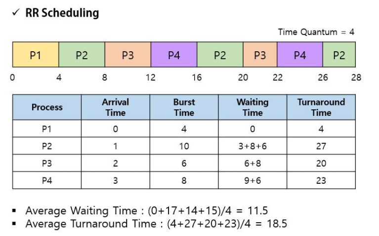
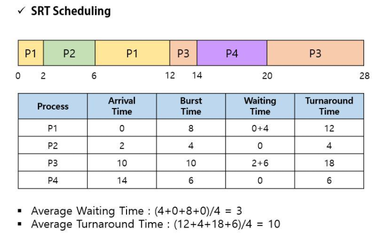
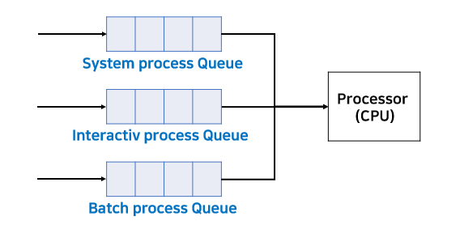
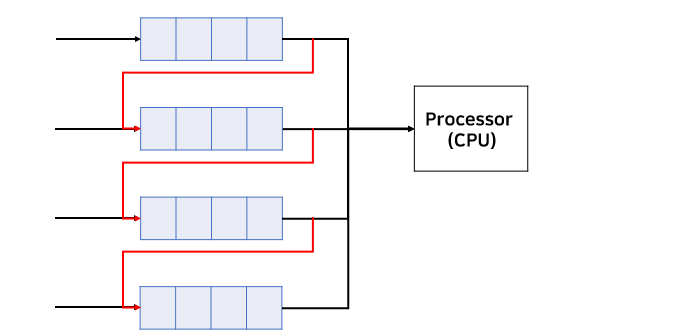

# CPU 스케줄링

### CPU 스케줄링 이란?

CPU가 하나의 작업(프로세스)가 끝나면 다음 작업을 수행해야 하는데 이 때, 어떤 프로세스를 처리할지 선택하는 것. 효율적으로 프로세스를 배정하는것이 중요

선점형(Preemptive) 스케줄링 방식과 비선점형(Non-Preemptive)방식이 있다.

선점형 방식의 경우 프로세스가 CPU를 점유하는 동안 다른 프로세스가 CPU를 강제로 점유하여 실행할 수 있다.

비선점형은 반대로 프로세스가 CPU점유중인동안 I/O나 인터럽트 같은 간섭이나 프로세스종료까지 다른 프로세스가 CPU를 점유하지 못하는 방식이다.

둘 다 장단점이 있고 상황에따라 효율성이 다르기 때문에 뭐가 더 좋다고 할수는 없다.

### 선점형 스케줄링

* 장점 : 우선순위가 높은 프로세스를 빠르게 처리할 수 있다.
* 단점 : 오버헤드가 크며(우선도가 높은 프로세스들이 들어오는 경우), 처리시간 예측이 어렵다.

#### 예시

##### 라운드 로빈(Round Robin 줄여서 RR)

* 프로세스마다 같은 크기의 CPU 시간을 할당하는 방식

* 이 시간내에 프로세스 처리를 완료 못한다면 큐의 가장 뒤로 보내지고 CPU는 다음 프로세스를 실행
* 모든프로세스에 균등한 CPU점유시간을 보장하며, 시분할 시스템을 사용한다
  * 시분할 시스템이란 CPU 스케줄링과 다중 프로그래밍을 이용해서 각 사용자들에게 컴퓨터 자원을 시간적으로 분할하여 사용할 수 있게 해주는 대화식 시스템을 의미한다.

출처:https://eun-jeong.tistory.com/17

##### SRT(Shortest Remaining Time First)

* 실행시간이 짧은 순서대로 프로세스를 수행하는 방식
* 현재 실행중인 프로세스의 남은 실행시간보다 실행시간이 짧은 프로세스가 큐에 들어오면 더 짧은 프로세스가 CPU를 선점한다.

출처:https://eun-jeong.tistory.com/17

##### 다단계 큐(Multi Level Queue)

* 프로세스들을 그룹으로 나누어 각 그룹마다 Ready Queue를 여러개 두며, 각 큐마다 다른 규칙을 지정이 가능하다.
* 여러개의 큐를 이용해서 상위단계 작업이 선점되는 방식

출처:https://github.com/WooVictory/Ready-For-Tech-Interview/blob/master/Operating%20System/CPU%20%EC%8A%A4%EC%BC%80%EC%A4%84%EB%A7%81.md

##### 다단계 피드백 큐(Multi Level Feedback Queue)

* 큐마다 서로 다른 CPU시간 할당량을 부여함
* 다단계 큐와 유사한 방식이지만 프로세스가 큐에서 다른 큐로 이동이 가능하다는 차이가 있다.
* 모든 큐는 가장 위의 큐에서 대기를 시작하며 대기시간이 매우 길어질 경우 아래에 있는 큐로 이동하는식으로 대기시간을 조정한다.
* 큐에서 프로세스가 실행되는 순서는 각 큐마다 FCFS방식으로 먼저들어온 순서대로 실행된다.
* 유연성이 뛰어나고 turnaround시간과 response time에 최적화된 알고리즘이다.

출처:https://github.com/WooVictory/Ready-For-Tech-Interview/blob/master/Operating%20System/CPU%20%EC%8A%A4%EC%BC%80%EC%A4%84%EB%A7%81.md

### 비선점형 스케줄링

* 한 프로세스가 CPU를 할당받았을 시 작업 종료까지 다른 프로세스는 CPU점유가 불가능하다.
* 모든 프로세스에 대한 요구를 공정하게 처리할 수 있지만, 작업시간이 짧은 프로세스가 긴시간을 대기해야하는 콘베이 현상이 발생할 수 있다.

##### FCFS(First Come First Server) (어디서 많이본 느낌의 이름아닌가?)

* 이름답게 큐를 활용한다.(First In First Out)
* 큐에 먼저 도착한 프로세스가 먼저 CPU를 점유하는 방식
* 실행시간이 긴 프로세스가 먼저 들어올경우 다소 비효율적임

##### SJF(Shortest-Job-First)

* FCFS가 먼저 들어온 순서였다면 이 방식은 현재 대기중인 프로세스중 실행시간이 짧은 순서대로 CPU를 먼저 할당하는 방식이다.
* 선점, 비선점방식 모두 가능하다.
* 프로세스의 웨이팅이 가장 적은 가장 효율적인 스케줄링 방법이지만 현실에선 실제 CPU점유시간을 알 수 없기 때문에 비현실적이다.
* 참고로 프로그래머스에 있는 디스크 컨트롤러 문제가 이 방식을 구현하는 문제이다.

##### Priority

* 우선순위가 높은 순서대로 실행되는 스케줄링 방식
* 우선순위는 정수값으로 주어지며 Unix/Linux기준 작은값이 우선순위가 높음
* 마찬가지로 선점, 비선점방식 모두 가능
* 우선순위가 낮은 큐가 오래도록 기다릴 수 있는 단점이 있기 때문에 ready queue에 일정시간이상 대기중인 프로세스의 우선순위를 높여주는 aging방식으로 해결할수가 있다.